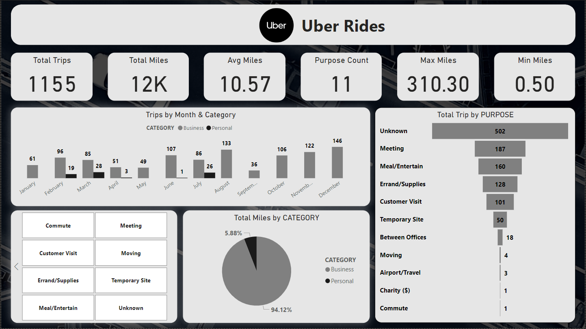

# Uber-Rides

# Description
This project is an interactive dashboard built to analyze Uber rides data, providing insights into trip counts, purposes, mileage, and trends over time. The dashboard is designed to assist users in better understanding the distribution and behavior of Uber rides across various categories and metrics.

Tools:
- Power Query power query data cleaning
  
- DAX : For data preparation, calculations, and measures.
  
- Power BI: For interactive dashboards and data visualization.

# Features

- Total Trips: Breakdown of over 1,100 trips categorized for detailed analysis.

- Monthly Trends: A clear visualization of trip counts by month and category (Business/Personal).

- Trip Purpose Analysis: Distribution of trips by purpose (e.g., Commute, Meetings, Errands).

- Mileage Insights: Minimum, maximum, average, and total miles for comprehensive trip analysis.

- Category Comparison: Detailed comparison of Business vs. Personal trips in terms of both count and mileage.

Conclusion
This project provides comprehensive insights into Uber rides data, including trends in trip counts, mileage, purposes, and monthly distributions.

The interactive dashboard enables users to explore data dynamically, uncover key patterns, and make data-driven decisions to optimize travel strategies and analyze trip behaviors effectively.

